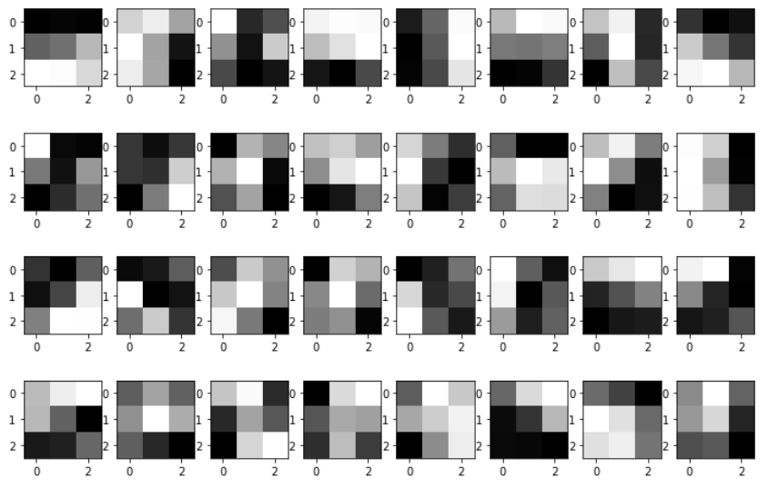

```{r setup, include=FALSE}
knitr::opts_chunk$set(echo = FALSE)
```

## Neural Nets

How do we improve upon the forecasting accuracy of a simpler model? 

Options:

- use bespoke column transformations (using subject-matter expertise), or 
- use a more flexible model, or 
- do both!


## Neural Nets

**Neural nets** are a class of nonlinear models that tend to 

- be used for larger data sets (i.e. text, speech, images, etc.),
- have many parameters, 
- and are biologically inspired.


We will focus on **feedforward networks**, and we'll use Keras

```{r,  out.width="20%", fig.align='right'}

```


## Our Example: MNIST


```{r, out.width="70%"}

```

```{r, out.width="70%"}

```


## This Lecture

This is a big field!

We avoid discussing:

- other types of neural nets (i.e. RNNs, RBMs, autoencoders, etc.)
- theoretical guarantees (if any)
- other types of data (speech, text, etc.)
- details of optimization algorithms
- regularization
- a detailed overview of this software (or other libraries).

All code is available at TODO


## A Starting Point: Softmax Regression 


Approximate $\mathbf{y}$ with 
$$
f(\mathbf{x}) = 
\text{softmax}( \mathbf{W}^T\mathbf{x} + \mathbf{b} ) 
$$
where
$$
\text{softmax}\left(
\begin{bmatrix}
z_1 \\
\vdots \\ 
z_n
\end{bmatrix}
\right)
= 
\begin{bmatrix}
\exp(z_1) \\
\vdots \\ 
\exp(z_n)
\end{bmatrix}
\Bigg /
\left( \sum_{i=1}^{10}\exp(z_i) \right)
$$


- $\mathbf{y} \in \{(0, \ldots, 1), \ldots, (1, \ldots, 0)\}$
- $\mathbf{x}$ is a length $784$ vector (a `Flatten`ed $28 \times 28 \times 1$ tensor)
- $\mathbf{b}$ is a vector of bias parameters
- $\mathbf{W}$ is a tall and skinny matrix of weight parameters 

then show image as numbers in two ways

## A Starting Point: Softmax Regression 

$$
f(\mathbf{x}) = 
\text{softmax}( \mathbf{W}^T\mathbf{x} + \mathbf{b} ) 
$$


## A Starting Point: Softmax Regression 

```{r, out.width="110%"}

```


## Training Our Regression Model

```{r, out.width="75%"}

```

```{r, out.width="40%"}

```


## What $\mathbf{W}$ is this model learning?


```{r, out.width="75%"}

```

Classification accuracy on the test data: $92.34\%$. 

**We can improve the accuracy if we transform the inputs intelligently. That's what hidden layers are for. **


## Adding a Hidden Layer

Approximate $\mathbf{y}$ with 
$$
f(\mathbf{x}) = 
\text{softmax}( \mathbf{W}^{(2)\intercal}\mathbf{h}  + \mathbf{b}^{(2)} ) 
$$
where 
$$
\mathbf{h} = g(\mathbf{W}^{(1)\intercal} \mathbf{x} + \mathbf{b}^{(1)})
$$
is the hidden layer, and $g$ is a nonlinear, elementwise, (usually) paramater-free **activation function**.

A size $64$ hidden layer increased accuracy to $97.31\%$. 


```{r, out.width="75%"}

```

## Visualizing Weights of the Hidden Layer


```{r, out.width="55%"}

```


## Visualizing Activations of the Hidden Layer (i.e. $\mathbf{h}$)

 
 .png)


## Convolutional Neural Networks

**Convolutional networks** have at least one layer that uses *convolution* instead of general matrix multiplication. They are popular for analyzing data that possess a grid-like topology.

They feature **sparse interactions**, **parameter sharing** and **equivariant representations**. They are also useful if your input images have different shapes!

## Convolutional Neural Networks

```{r, out.width="60%", fig.cap="\\label{fig:fig1}Figure from *Deep Learning* (Goodfellow, Bengio and Courville)"}

```

## Max Pooling Layers

TODO


## Convolutional Neural Networks


```{r, out.width="100%"}

```
This yields $98.51\%$ accuracy on the test set.

## Visualizing the CNN's Kernels


```{r, out.width="100%"}

```


## Visualizing Convolutions


```{r, out.width="60%"}

```


## Where Do We Go From Here?


<!-- TODO read chapter 6 section -->


